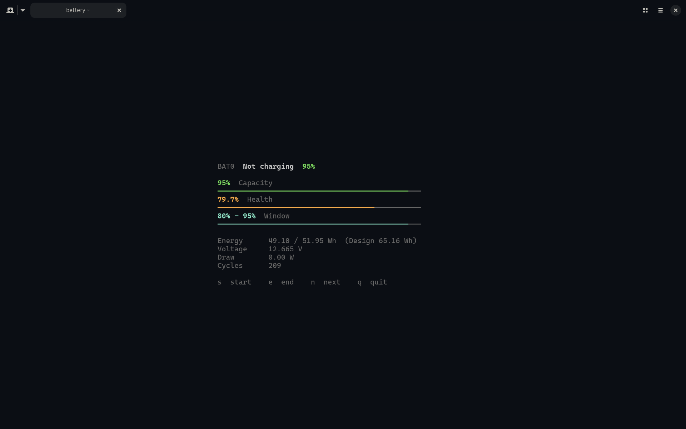
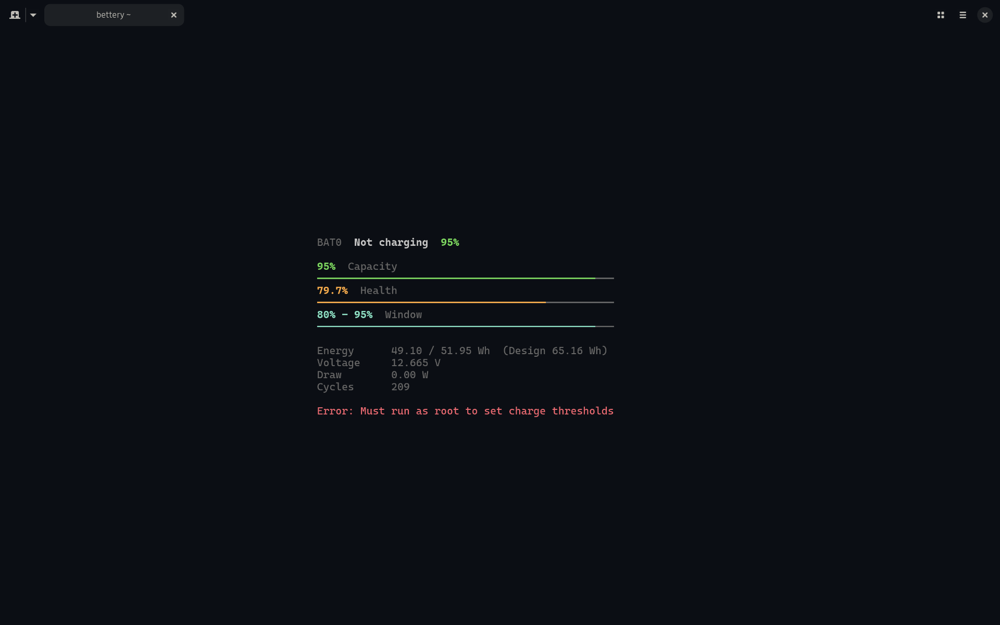
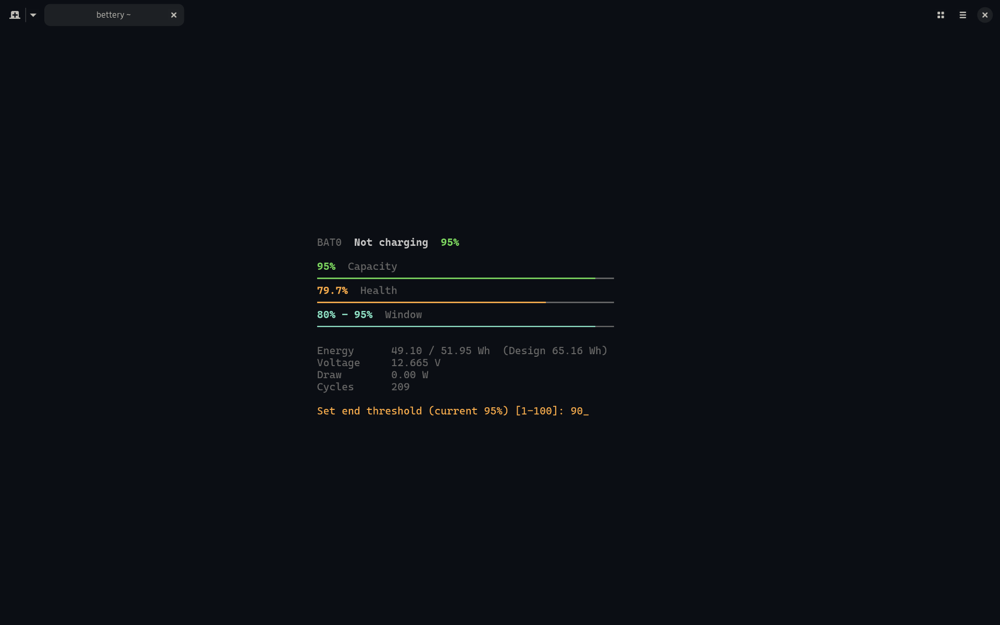
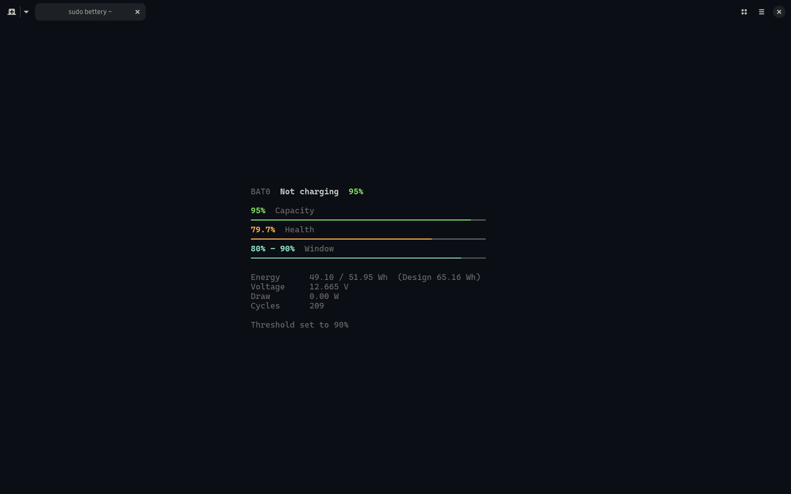

# Bettery

A minimal TUI battery manager for Linux.



## Features

- Live battery stats: capacity, health, voltage, energy, power draw, cycle count, temperature, time remaining
- Color-coded bars (green/yellow/red) for capacity, health, and charge window
- Set charge start/end thresholds on supported laptops (requires root)
- Multiple battery support (navigate with `n`)
- Persistent TOML config at `~/.config/bettery/config.toml`

## Build & Install

```bash
cargo build --release
sudo cp target/release/bettery /usr/local/bin/
bettery
```

## Usage

### Read-Only Monitoring

Run as a normal user to monitor battery stats:

```bash
bettery
```

If you attempt to modify thresholds in this mode, you will see a permission error:



### Setting Charge Thresholds

Run with root privileges to set charge start/end thresholds:

```bash
sudo bettery
```

1. Press `s` (start) or `e` (end) to enter input mode and type the desired threshold:
   
2. Press `Enter` to apply it:
   

### Keybindings

| Key | Mode | Action |
|-----|------|--------|
| `s` | Normal | Enter start threshold input |
| `e` | Normal | Enter end threshold input |
| `n` | Normal | Switch to next battery |
| `q` | Normal | Quit |
| `Ctrl+C` | Normal | Quit |
| `Esc` | Input | Cancel input |
| `Enter` | Input | Confirm and apply threshold |
| `Backspace` | Input | Delete last digit |
| `0-9` | Input | Append digit |

## Configuration

Auto-created on first run at `~/.config/bettery/config.toml`:

```toml
refresh_interval_ms = 2000
charge_start_threshold = 20
charge_end_threshold = 80
```

## Notes

- **Root required** for setting charge thresholds. The sysfs files `charge_control_start_threshold` and `charge_control_end_threshold` require write privileges.
- Tested on laptops with sysfs threshold support (Honor, Huawei, Lenovo, ASUS).
- Config directory follows `$XDG_CONFIG_HOME` when set, otherwise defaults to `~/.config/`.
